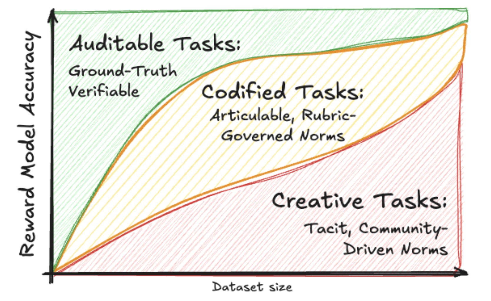
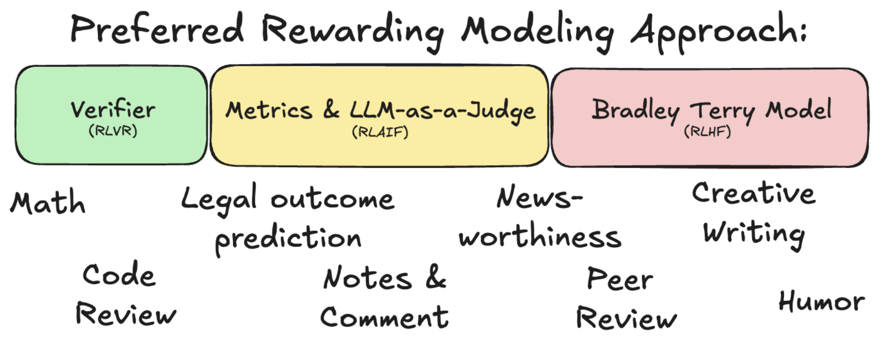
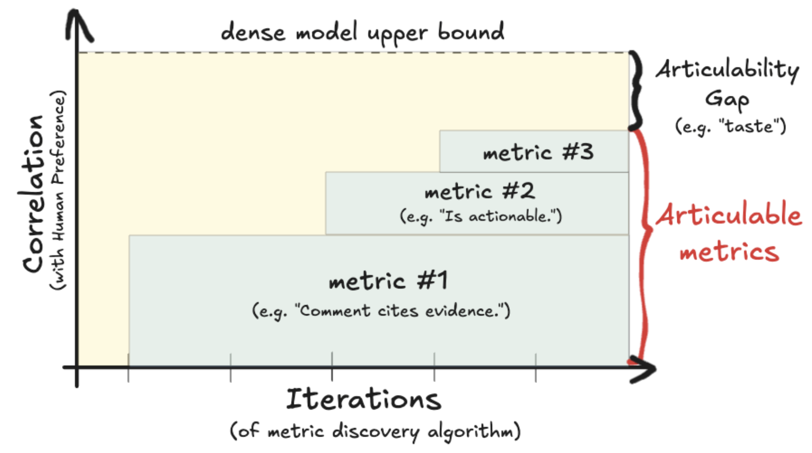

# Goals and Overview
This research aims to measure the articulability gap by comparing dense models trained on human feedback data against articulated models that rely on explicit, human-interpretable criteria. We are trying to understand when learned latent objectives outperform explicit, structured objectives, and when the reverse is true. The core idea is to benchmark performance, sample efficiency, and generalization across multiple tasks while holding data access and evaluation protocols as constant as possible.

<p align="center">
  
  <br/>
  <em>We aim to study how reward models in different domains model human preference. For Creative Tasks with more diffuse, community-originated norms, we expect to require more training data than Codified Tasks, with articulated rules. Auditable tasks, which often can be objectively verified, require the least data.</em>
</p>

<p align="center">
  
  <br/>
  <em>From a computer-science perspective, we aim to provide insights into which reward approach works in different settings.</em>
</p>

# Usage
Dense training is orchestrated through the sweep script, which runs `methods/dense/train_reward_model.py` over multiple data fractions.

```bash
./train_sweep.sh datasets/creative-writing/LitBench-Train.csv.gz runs/sweep_01 --use-optuna --optuna_trials 20
```

You can also run a single training job directly:

```bash
python methods/dense/train_reward_model.py \
  --data_path datasets/creative-writing/LitBench-Train.csv.gz \
  --output_dir runs/single_run
```

# File structure
- `methods/dense/` contains dense model training code and FSDP configs.
- `methods/autometrics/` contains articulated/metric-based modeling code.
- `scripts/` contains runnable utilities (e.g., `scripts/run_autometrics_vllm.py`).
- `datasets/` contains task data organized by domain.
- `runs/` contains training outputs and logs.
- `notebooks/` contains exploratory analysis and data prep notebooks.

## Model Training

<p align="center">
  
  <br/>
  <em>We aim to measure dense modeling performance as an upper bound to measure the noise in a task. We seek to measure how close we can approximate this upper bound with articulable metrics.</em>
</p>

<table>
  <thead>
    <tr>
      <th>Approach</th>
      <th>Model</th>
      <th>Press Releases</th>
      <th>Legal Outcome Prediction</th>
      <th>Code Review</th>
      <th>Creative Writing</th>
      <th>Grant Funding</th>
      <th>Humor</th>
      <th>Peer Review</th>
    </tr>
  </thead>
  <tbody>
    <tr>
      <td rowspan="4" style="writing-mode: vertical-rl; text-orientation: mixed;"><strong>Dense</strong></td>
      <td>Llama-3.3-8b (10%–100%)</td>
      <td>✓</td>
      <td></td>
      <td></td>
      <td></td>
      <td></td>
      <td></td>
      <td></td>
    </tr>
    <tr>
      <td>Llama-3.3-70b (10%–100%)</td>
      <td></td>
      <td></td>
      <td></td>
      <td></td>
      <td></td>
      <td></td>
      <td></td>
    </tr>
    <tr>
      <td>Phi 4</td>
      <td></td>
      <td></td>
      <td></td>
      <td></td>
      <td></td>
      <td></td>
      <td></td>
    </tr>
    <tr>
      <td>GLM 4.6 (?)</td>
      <td></td>
      <td></td>
      <td></td>
      <td></td>
      <td></td>
      <td></td>
      <td></td>
    </tr>
    <tr>
      <td rowspan="5" style="writing-mode: vertical-rl; text-orientation: mixed;"><strong>Articulable</strong></td>
      <td>Autometrics ++</td>
      <td></td>
      <td></td>
      <td></td>
      <td></td>
      <td></td>
      <td></td>
      <td></td>
    </tr>
    <tr>
      <td>EM Algorithm</td>
      <td></td>
      <td></td>
      <td></td>
      <td></td>
      <td></td>
      <td></td>
      <td></td>
    </tr>
    <tr>
      <td>Google Taxonomy Generation</td>
      <td></td>
      <td></td>
      <td></td>
      <td></td>
      <td></td>
      <td></td>
      <td></td>
    </tr>
    <tr>
      <td>Sheldon's Bandit Algorithm</td>
      <td></td>
      <td></td>
      <td></td>
      <td></td>
      <td></td>
      <td></td>
      <td></td>
    </tr>
    <tr>
      <td>Human-derived Metrics found online</td>
      <td></td>
      <td></td>
      <td></td>
      <td></td>
      <td></td>
      <td></td>
      <td></td>
    </tr>
  </tbody>
</table>

## Dataset Collection
- Coding ❓
- Legal Outcome Prediction 🟨
- Grants (Rio, OGrants, NIH) 🟨
- Press Releases ✅
- City Council Discussions ❌
- Creative Writing ✅
- Humor ✅
- Wikipedia Editorial Decisions ❌
- Patent examiner decisions 🟨
- News homepages 🟨
